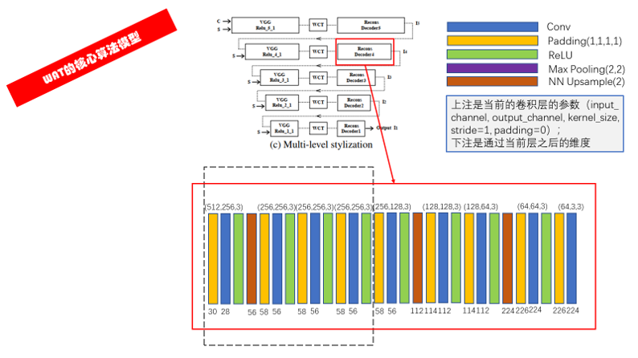
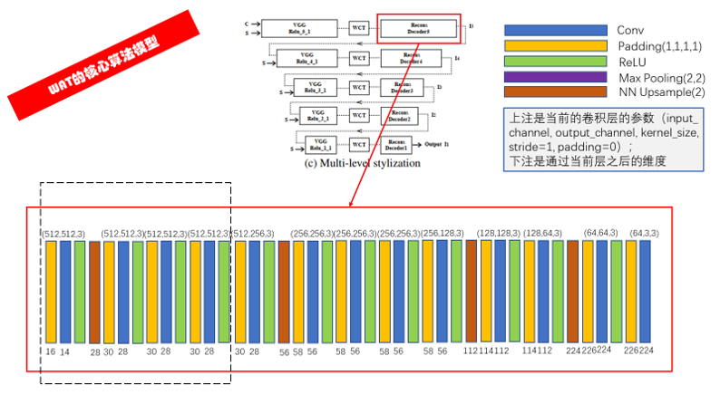

<!--
 * @Description: 
 * @Author: fangn
 * @Github: 
 * @Date: 2019-11-19 16:07:26
 * @LastEditors: fangn
 * @LastEditTime: 2019-11-21 19:00:26
 -->
# WCT_Pytorch

## 论文地址
[Universal Style Transfer via Feature Transforms](https://arxiv.org/abs/1705.08086)

## 参考代码
- [sunshineatnoon/PytorchWCT](https://github.com/sunshineatnoon/PytorchWCT)

## 参考资料
- [风格转移之WCT（Whiten- Color Transform）](https://blog.csdn.net/zwx1995zwx/article/details/79667068)
- [《Universal Style Transfer via Feature Transforms》论文解读](https://blog.csdn.net/maqunfi/article/details/89296648)

## 说明

### 网络模型概览

### 通用编译码

### WCT

### 级联结构

#### ReLU_1_1

#### ReLU_2_1

#### ReLU_3_1

#### ReLU_4_1

#### ReLU_5_1

